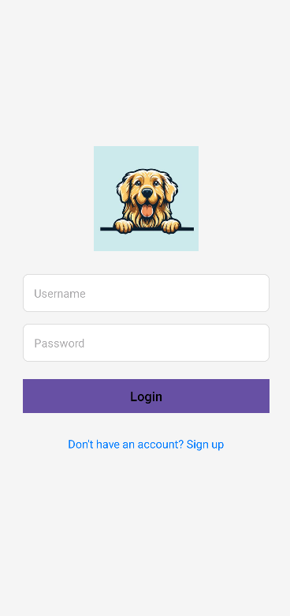

# 🐶 DogExpert App

**DogExpert** is a mobile application designed to help dog owners find and purchase high-quality dog food and nutrition-related products. The app also provides educational content to help users make informed decisions about their pets’ dietary needs.

---

## 🚀 Features

### 🔐 User Authentication & Profile Management
- Register and log in with email
- Manage personal profiles
- Edit contact info, shipping addresses, and payment methods

### 🛒 Product Catalog
- Browse a wide variety of dog food and nutrition products
- Filter by brand, food type, dog age, and more
- View product details including descriptions, prices, and reviews

### 🧺 Shopping Cart
- Add items to a cart for review before purchase
- Update quantities, remove items, and view real-time totals
- Seamless checkout experience

### 📚 Educational Content
- Articles, videos, and guides about dog nutrition
- Breed-specific dietary advice
- Health tips and feeding guidelines based on life stage

---

## 📱 Screenshots

_Coming Soon: Add screenshots of your app here to showcase the UI_

---

## 🔧 Technologies Used

- **Android (Java/Kotlin)** or **Flutter (if applicable)**
- Firebase Authentication
- Firebase Firestore or Realtime Database
- Firebase Storage (for product images)
- Modern UI/UX Design principles

---

## Image Screenshot


## 📦 Setup Instructions

1. Clone the repo:
   ```bash
   git clone https://github.com/your-username/dogexpert-app.git
